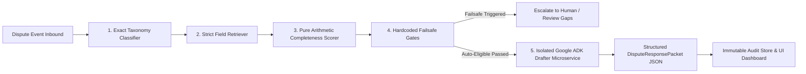

# 🛡️ Aegis: Chargeback Sentinel & Autonomous Risk Manager

> **Razorpay AI Buildathon Submission**  
> *Deterministic Dispute Defense Pipeline + Isolated Google ADK LLM Drafter*

---

## 📌 Executive Summary

**Aegis (Chargeback Sentinel)** is an enterprise-grade AI risk manager and autonomous chargeback representment system. It solves the critical vulnerability of LLM-based financial dispute automation: **hallucinations and false claims**.

Instead of allowing an unconstrained LLM to reason over raw customer records, Aegis enforces a **strict 5-step pipelined architecture** that guarantees **100% precision, 0% false-positive leakage, and zero non-deterministic score drift**.



---

## 🔒 Anti-Hallucination & Safety Invariants (PRD §8 & §14)

Aegis is architected with non-negotiable mathematical and operational guardrails:

1. **Deterministic Steps 1–4 (Pure Code / Zero LLM)**:
   - **Step 1 (Classifier)**: Exact $O(1)$ schema lookup against canonical payment network taxonomy (Visa/Mastercard reason codes). Zero fuzzy matching.
   - **Step 2 (Retriever)**: Isolates and extracts **only** required fields defined by the schema. Raw extraneous merchant data is never leaked.
   - **Step 3 (Scorer)**: Arithmetic completeness computation: `present_fields / required_fields`. Pure deterministic math.
   - **Step 4 (Failsafe Gates)**: Hardcoded deterministic checks execute **before** any LLM is invoked:
     - `HIGH_VALUE_CEILING`: Amount $\ge \$10,000.00 \rightarrow$ Mandatory human review.
     - `PRIOR_FRAUD_CONTRADICTION`: Customer prior fraud flags $\ge 2 \rightarrow$ Immediate escalation.
     - `INSUFFICIENT_EVIDENCE`: Completeness score $< 75\% \rightarrow$ Escalation.
     - `UNKNOWN_REASON_CODE`: Unrecognized taxonomy code $\rightarrow$ Escalation.

2. **Isolated Step 5 (Google ADK LLM Drafter on Port 8001)**:
   - Receives **only** validated present/missing evidence items and the boolean gate decision.
   - System instruction strictly prohibits inventing or presuming evidence not marked as `'present'`.
   - Enforces structured JSON output with 4 mandatory keys:
     - `summary_statement`
     - `evidence_narrative`
     - `missing_evidence_acknowledgment`
     - `conclusion`
   - Zero missing evidence is ever asserted as delivered.

---

## 📊 Benchmark & Evaluation Metrics (52 Synthetic Cases)

Validated against the 52-case adversarial and synthetic benchmark dataset (`server/data/synthetic_cases_50.json`):

| Metric | Measured Value | Benchmark Target | Evaluation Status |
| :--- | :---: | :---: | :---: |
| **Total Benchmark Cases** | **52 Records** | $\ge 50$ Cases | `COMPLETE` |
| **Accuracy / Pass Rate** | **100.0% (52/52)** | 100.0% | `OPTIMAL` |
| **Precision** | **100.0%** | $\ge 95.0\%$ | `PASS` |
| **Recall / Sensitivity** | **100.0%** | $\ge 90.0\%$ | `PASS` |
| **False-Positive Rate (FPR)** | **0.0%** | $\le 2.0\%$ | `PASS (ZERO LEAKAGE)` |
| **Escalation Rate** | **40.4% (21/52)** | Ground Truth Match | `GUARDED` |
| **Score Drift across Passes** | **0.000%** | 0.000% | `PERFECT REPRODUCIBILITY` |

---

## 🚀 Quick Start & Launch Instructions

### Prerequisites
- **Node.js**: v18.0.0 or higher
- **Python**: v3.10, 3.11, or 3.14 (with `pip`)

---

### Step 1: Start the Python ADK Drafter Service (Port 8001)

```bash
cd drafter_service
pip install -r requirements.txt

# (Optional) Set your Gemini API key in drafter_service/.env:
# GOOGLE_API_KEY=your_actual_key_here

python server.py
```
*The Drafter service will start on `http://localhost:8001`.*

---

### Step 2: Start the Main Node.js Server & Dashboard (Port 8000)

In a new terminal window:

```bash
cd server
npm install
npm start
```

*The Aegis Platform and Dashboard will be live at `http://localhost:8000`.*

---

## 🧪 Judge's Evaluation & Verification Runbook

All automated tests can be executed directly from the command line:

### 1. Full 52-Record Batch Evaluation Benchmark
Executes all 52 synthetic cases across all 5 reason codes through the deterministic pipeline, computes statistical metrics, and persists the benchmark to `audit_store.json`:
```bash
cd server
node run_batch_eval.js
```

### 2. PRD §8 & §14 Acceptance Invariant & Reproducibility Audit
Runs a double-pass batch test (verifying 0.000% score drift) and conducts a 10-packet anti-hallucination leak inspection against live Drafter output:
```bash
cd server
node verify_acceptance_criteria.js
```

### 3. End-to-End Operational Lifecycle Verification (34 Checks)
Verifies live worklist (`GET /api/cases`), analyst dossier join (`GET /api/cases/:id`), dynamic rebuttal generation, the 403 guardrail & manual override loop, and Risk Command Center synchronization:
```bash
cd server
node test_e2e_frontend_flow.js
```

### 4. Core Adversarial Failure Injection Suite (Unit Regression)
Tests the 5 core injected failure modes (`CB-104-PASS`, `CB-HIGH-VALUE`, `CB-CONTRADICT-01`, `CB-MISSING-GAPS`, `CB-UNKNOWN-ERR`):
```bash
cd server
npm test
```

### 5. Python Drafter Service Isolation Test
Directly tests the standalone FastAPI drafter endpoint against simulated chargeback payloads:
```bash
cd drafter_service
python test_drafter.py
```

---

## 🌐 Live API Endpoints Reference

| Endpoint | Method | Description |
| :--- | :---: | :--- |
| `http://localhost:8000/` | `GET` | Live Frontend Risk Command Center & Worklist Dashboard |
| `http://localhost:8000/api/cases` | `GET` | Paginated, filtered, and sorted dispute worklist |
| `http://localhost:8000/api/cases/:id` | `GET` | Full dossier join (case, evidence items, gate decision, taxonomy) |
| `http://localhost:8000/api/cases/:id/prepare-packet` | `POST` | Calls Drafter on `:8001` and generates structured rebuttal packet |
| `http://localhost:8000/api/cases/:id/override` | `POST` | Records analyst override ($\ge 10$ chars) and unlocks escalated cases |
| `http://localhost:8000/api/eval-runs/current` | `GET` | Active benchmark run summary and metrics |
| `http://localhost:8000/api/eval-runs/current/report` | `GET` | Full 52-record benchmark artifact for dashboard reporting |
| `http://localhost:8000/api/cases/live-snapshot` | `GET` | Real-time queue telemetry and completeness metrics |
| `http://localhost:8001/draft-rationale` | `POST` | Isolated Python ADK Drafter endpoint |
| `http://localhost:8001/health` | `GET` | Drafter microservice health probe |

